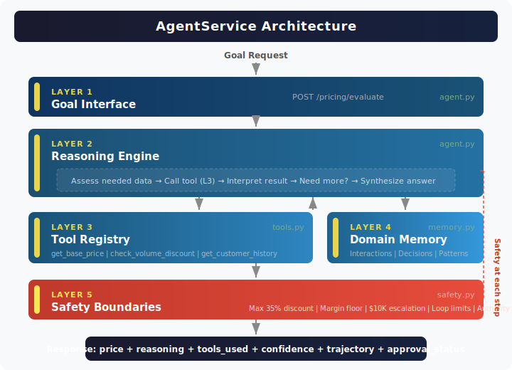

# From Microservice to AgentService

**A working example of migrating a traditional microservice to an AgentService.**

This repo accompanies the blog post: [From Microservice to AgentService: Your Services Need to Think Now](https://medium.com/@skdhir)

It contains two implementations of the same domain — a pricing service — showing the before and after of an AgentService migration.

---

## What's Inside

```
├── pricing_service/          # The "Before" — a traditional microservice
│   └── app.py                # FastAPI, deterministic logic, rigid contracts
│
├── pricing_agent/            # The "After" — an AgentService
│   ├── agent.py              # Reasoning engine + goal interface
│   ├── tools.py              # Existing business logic wrapped as callable tools
│   ├── memory.py             # Domain memory layer
│   └── safety.py             # Safety boundaries and guardrails
│
├── tests/
│   ├── test_microservice.py  # Traditional API tests (assert on payloads)
│   └── test_agentservice.py  # AgentService evals (trajectory, reasoning, safety)
│
├── docs/
│   ├── SYSTEM_DESIGN.md             # Deep architectural reasoning behind the 5 layers
│   ├── MIGRATION_GUIDE.md           # Step-by-step checklist for migrating your own service
│   └── before-after-comparison.svg  # Visual side-by-side comparison
│
├── agentservice-architecture.svg    # 5-layer architecture diagram
├── requirements.txt
└── README.md
```

## The 5-Layer AgentService Architecture

This repo maps directly to the five layers that distinguish an AgentService from a microservice:

| Layer | What It Does | Where in Code |
|-------|-------------|---------------|
| **1. Goal Interface** | Accepts outcomes, not just inputs | `pricing_agent/agent.py` — `POST /pricing/evaluate` |
| **2. Reasoning Engine** | LLM-powered planning and decision-making | `pricing_agent/agent.py` — `PricingAgent.reason()` |
| **3. Tool Registry** | Existing business logic as callable tools | `pricing_agent/tools.py` — same logic from the microservice, now wrapped as tools |
| **4. Domain Memory** | Persistent context that informs reasoning | `pricing_agent/memory.py` — customer history, interaction patterns |
| **5. Safety Boundaries** | Guardrails, scope limits, human escalation | `pricing_agent/safety.py` — max discount caps, approval thresholds |

## Quick Start

```bash
# Install dependencies
pip install -r requirements.txt

# Run the microservice (the "before")
uvicorn pricing_service.app:app --port 8000

# Run the AgentService (the "after")
uvicorn pricing_agent.agent:app --port 8001

# Run tests
pytest tests/ -v
```

## The Migration in Practice

### Before: PricingService

```
GET /price/WIDGET-PRO → { "price": 99.99, "currency": "USD" }
```

Rigid contract. Deterministic. No context. No reasoning.

### After: PricingAgent

```
POST /pricing/evaluate
{
  "goal": "Find optimal price for customer C-1234 buying WIDGET-PRO,
           considering they've purchased 3 times this quarter and
           competitor X is running a 20% promotion"
}
```

```json
{
  "recommended_price": 84.99,
  "reasoning": "Applied 15% loyalty discount (3 purchases this quarter). Competitor promo at 20% noted but our margin floor is $80. Recommended $84.99 balances retention with margin target.",
  "tools_used": ["get_base_price", "check_volume_discount", "get_customer_history", "get_competitor_pricing"],
  "confidence": 0.87,
  "requires_approval": false
}
```

Goal-oriented. Context-aware. Explainable. Guardrailed.

### What Changed (and What Didn't)

**Changed:**
- Contract: procedure-oriented → goal-oriented
- Logic: deterministic rules → reasoning over rules-as-tools
- State: stateless → domain memory
- Errors: status codes → intelligent recovery
- Testing: payload assertions → trajectory evaluation

**Stayed the same:**
- Domain boundary (pricing owns pricing)
- Core business logic (discount rules, rate tables — now wrapped as tools)
- Infrastructure (FastAPI, containerizable, same deployment model)
- Team ownership model

## Environment Variables

```bash
# Optional — only needed for LLM-powered reasoning (Layer 2)
# Without these, the AgentService uses a rule-based fallback
# that demonstrates the same 5-layer architecture
OPENAI_API_KEY=your-key-here       # Enables LLM reasoning path
MODEL_NAME=gpt-4o                   # Model for reasoning engine (default: gpt-4o)
```

## Testing Philosophy

The `tests/` directory demonstrates two fundamentally different testing approaches:

**`test_microservice.py`** — Traditional API tests. Input X → Output Y. Deterministic, repeatable.

**`test_agentservice.py`** — AgentService evaluations:
- **Task completion**: Did the agent achieve the goal?
- **Tool selection**: Did it use the right tools?
- **Reasoning quality**: Was the logic sound? (LLM-as-judge)
- **Safety compliance**: Did it respect boundaries?
- **Consistency**: Same goal, multiple runs — how much variance?

## Architecture Diagram



See also: [Before/After Comparison](docs/before-after-comparison.svg)

## Deep Dives

- **[System Design](docs/SYSTEM_DESIGN.md)** — Architectural reasoning behind each layer, cost implications, what changes vs. what stays the same, and when NOT to migrate
- **[Migration Guide](docs/MIGRATION_GUIDE.md)** — Step-by-step checklist for migrating your own microservice. Each stage is independently deployable.

## License

MIT

## Author

Sanat Dhir — [LinkedIn](https://www.linkedin.com/in/skdhir/) | [Medium](https://medium.com/@skdhir)

*Engineering leader. 20+ years building distributed systems. Columbia Executive MBA. Writing about the evolution from microservices to AgentServices.*
